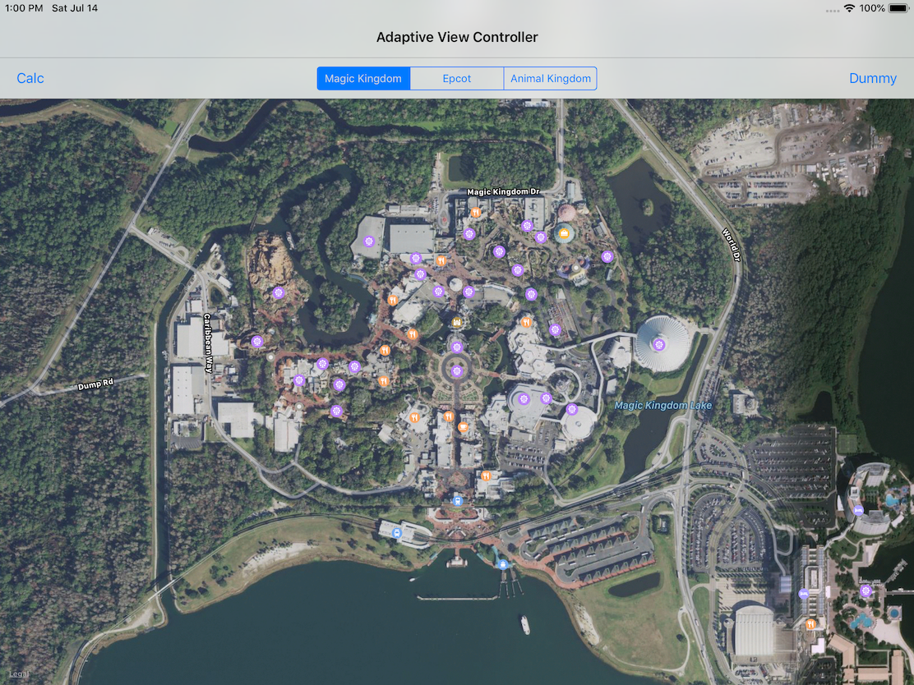
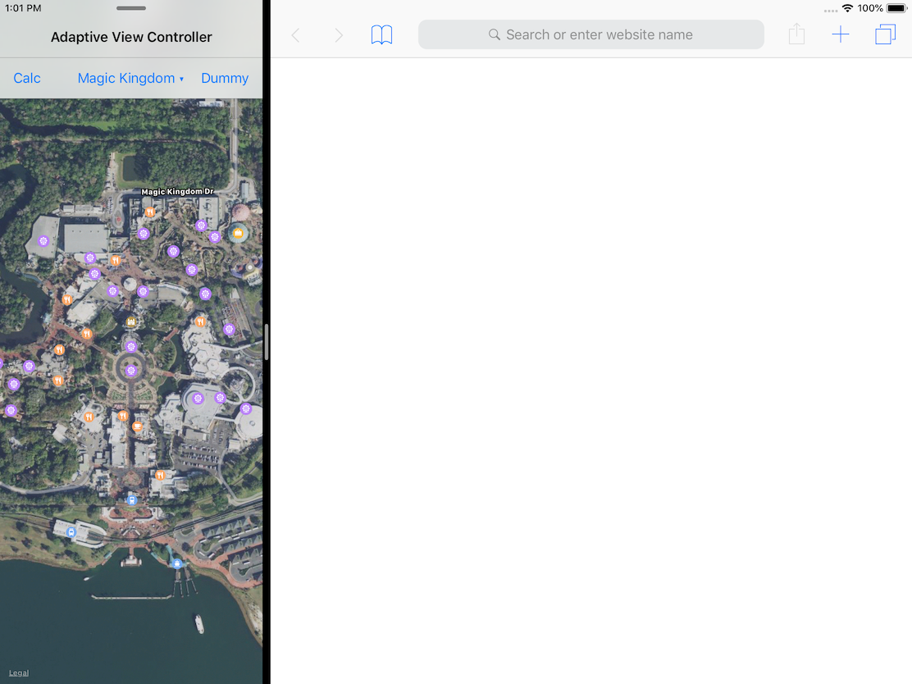
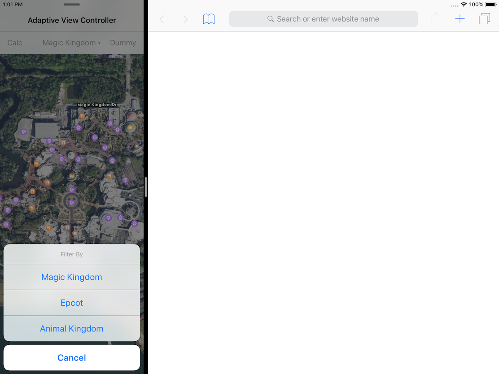

# Adaptive Layout Demo

This is demo code was presented at the July 2018 St. Louis CocoaHeads "July 'Blast' Talks".

### Inspiration
- The demo attempts to mimic how the iOS Files app adapts the "Filter" actions toolbar to horizontal size class changes.

### Main Highlights
- Use Auto Layout and Container `UIViewController`s to adapt the UI to horizontal size class changes
- Embed a child view controller's `view` in a `UIBarButtonItem` as a custom view
- The custom view displayed in the `UIBarButtonItem` is either a standard `UIButton` or `UISegmentedControl`
- Selecting an "action" changes the region of the map view

#### Here's how it works

- If the horizontal size class is `regular`, then
- the view shows a `UISegmentedControl`
- there's a segment for each `AdaptiveAction`
- tapping a segment executes the "bound" `AdaptiveAction`

- If the horizontal size class is `compact`, then
  - the toolbar shows a `UIButton`
  - tapping the button displays an alert controller as an action sheet
  - there's a `UIAlertAction` for each `AdaptiveAction`
  - tapping an alert action executes the "bound" `AdaptiveAction`

 

### Secondary Highlights
- Adding a simple extension to make it easy to create  `UIBarButtonItem` "flexible space" items
- Changing the `UIBarPosition` to render a "separator line" when adding a `UIToolbar` to the "top" of a view
- Changing a `MKMapView`'s region using Foundation's Measurents API to achieve an approximate "zoom" level
